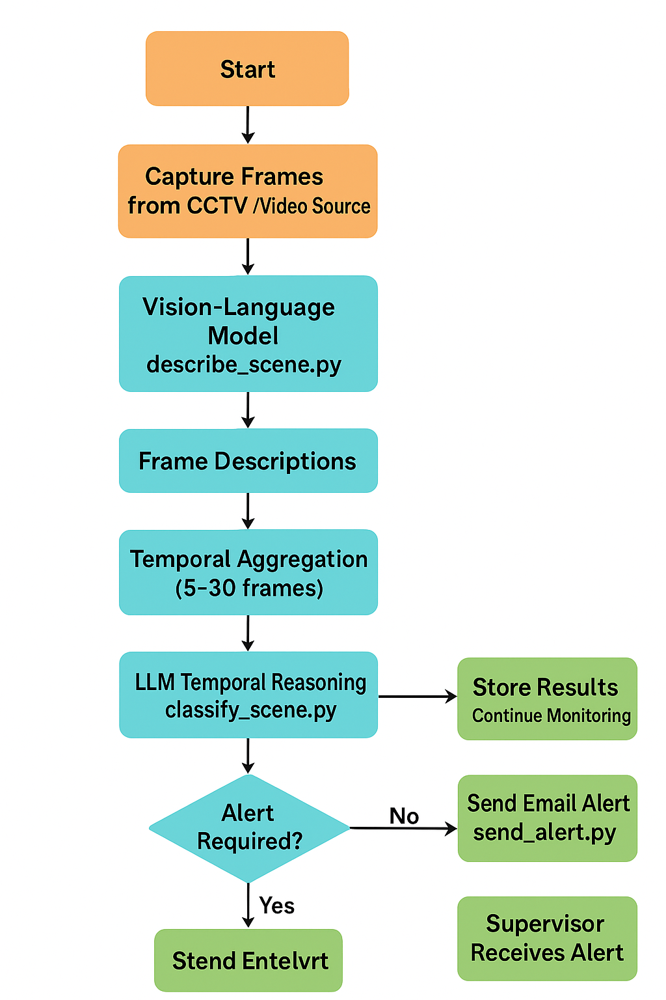

# 🛒 Theft Detection System using Vision-Language Models (VLM) + LLM Reasoning

A modular, AI-powered retail theft detection system that analyzes CCTV footage using **Vision-Language Models (VLMs)** and **Large Language Models (LLMs)** to identify suspicious behavior and automatically trigger alerts.  
This project combines multimodal visual understanding, temporal reasoning, and automated email notifications into a production-ready pipeline.

---

## 🚀 Key Features

### 🔍 1. Vision-Language Scene Understanding  
Uses a VLM (e.g., LLaMA 3.2 Vision) to:
- Describe CCTV frames in natural language  
- Detect human actions, posture, and interactions  
- Extract contextual cues (loitering, concealment, unusual handling)

---

### 🧠 2. LLM Temporal Reasoning  
Aggregates 5–30 frame descriptions and performs:
- Timeline summarization  
- Suspicious behavior classification  
- Risk scoring (Low / Medium / High)  
- Structured JSON output such as:

```json
{
  "timeline_summary": "...",
  "suspect_actions": [...],
  "risk_assessment": "medium",
  "alert": true
}


